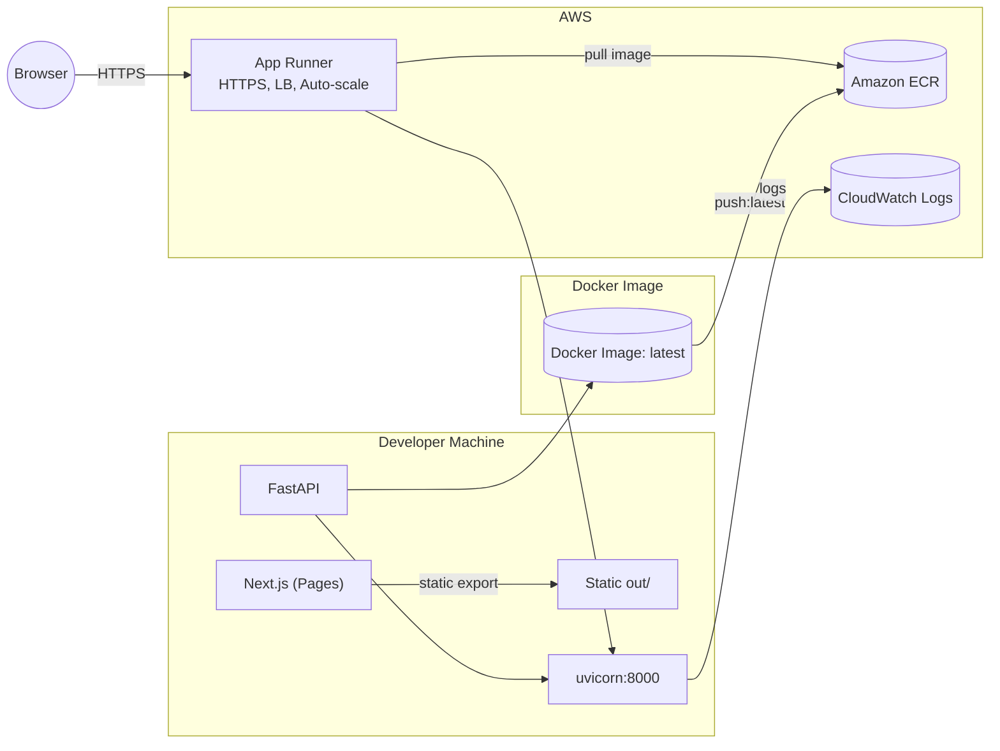

# Healthcare Consultation Assistant (Next.js + FastAPI → AWS App Runner)

Deploy a full-stack Healthcare Consultation Assistant from local dev to AWS App Runner using a single Docker image. The frontend is a static Next.js export and the backend is FastAPI serving both the API and static assets.

> **Why this approach?**  
> - One container, one runtime, one URL  
> - App Runner handles HTTPS, autoscaling, and load balancing  
> - Works great for “Vercel → AWS” migrations

---

## Table of Contents

- [Architecture](#architecture)
- [Tech Stack](#tech-stack)
- [Project Structure](#project-structure)
- [Local Development](#local-development)
- [Environment Variables](#environment-variables)
- [Docker (Build & Run)](#docker-build--run)
- [AWS Setup (Budgets, IAM, ECR, App Runner)](#aws-setup-budgets-iam-ecr-app-runner)
- [Deploy: Build → Push → Release](#deploy-build--push--release)
- [Updating a Deployment](#updating-a-deployment)
- [Monitoring & Debugging](#monitoring--debugging)
- [Troubleshooting](#troubleshooting)
- [Cost & Safety Controls](#cost--safety-controls)
- [Next Steps](#next-steps)
- [License](#license)

---

## Architecture


---

## Tech Stack

- **Frontend:** Next.js `output: 'export'` (static), React 19, Tailwind plugins
- **Backend:** FastAPI + Uvicorn, SSE via `@microsoft/fetch-event-source`
- **Auth:** Clerk (client components + JWT verification in FastAPI)
- **LLM:** OpenAI SDK
- **Infra:** Docker, Amazon ECR, AWS App Runner, CloudWatch

---

## Project Structure

```
saas/
├─ pages/                  # Next.js Pages Router
├─ styles/
├─ api/
│  └─ server.py            # FastAPI app + static serving + /health
├─ public/
├─ node_modules/
├─ .env.local              # local env (never commit)
├─ .env                    # used for builds/deploys (never commit)
├─ package.json
├─ requirements.txt
├─ next.config.ts          # output: 'export', images.unoptimized
├─ tsconfig.json
├─ Dockerfile
└─ .dockerignore
```

---

## Local Development

**Install deps:**
```bash
npm ci
```

**Run Next dev server:**
```bash
npm run dev
```

> The production container serves the static Next export from FastAPI. For local prod-like testing, use Docker (below).

---

## Environment Variables

Create **`.env`** for build/push/deploy (copy values from `.env.local` and add AWS):

```dotenv
NEXT_PUBLIC_CLERK_PUBLISHABLE_KEY=pk_test_...
CLERK_SECRET_KEY=sk_test_...
CLERK_JWKS_URL=https://...
OPENAI_API_KEY=sk-...

# AWS (choose a single region and stick to it)
DEFAULT_AWS_REGION=us-east-1
AWS_ACCOUNT_ID=123456789012
```

> Do **not** commit `.env` or `.env.local`. Add them to `.gitignore`.

---

## Docker (Build & Run)

### Build (Node → static export → Python runtime)

Dockerfile (already in repo):
```dockerfile
# Stage 1: Build the Next.js static files
FROM node:22-alpine AS frontend-builder
WORKDIR /app
COPY package*.json ./
RUN npm ci
COPY . .
ARG NEXT_PUBLIC_CLERK_PUBLISHABLE_KEY
ENV NEXT_PUBLIC_CLERK_PUBLISHABLE_KEY=$NEXT_PUBLIC_CLERK_PUBLISHABLE_KEY
RUN npm run build

# Stage 2: Final Python container
FROM python:3.12-slim
WORKDIR /app
COPY requirements.txt .
RUN pip install --no-cache-dir -r requirements.txt
COPY api/server.py .
COPY --from=frontend-builder /app/out ./static
HEALTHCHECK --interval=30s --timeout=3s --start-period=5s --retries=3   CMD python -c "import urllib.request; urllib.request.urlopen('http://localhost:8000/health')"
EXPOSE 8000
CMD ["uvicorn", "server:app", "--host", "0.0.0.0", "--port", "8000"]
```

**Apple Silicon (M1/M2/M3) users:** always build with `--platform linux/amd64`.

**Build:**
```bash
# load env into current shell (Mac/Linux)
export $(cat .env | grep -v '^#' | xargs)

docker build   --platform linux/amd64   --build-arg NEXT_PUBLIC_CLERK_PUBLISHABLE_KEY="$NEXT_PUBLIC_CLERK_PUBLISHABLE_KEY"   -t consultation-app .
```

**Run (local prod):**
```bash
docker run -p 8000:8000   -e CLERK_SECRET_KEY="$CLERK_SECRET_KEY"   -e CLERK_JWKS_URL="$CLERK_JWKS_URL"   -e OPENAI_API_KEY="$OPENAI_API_KEY"   consultation-app
```

Open http://localhost:8000

---

## AWS Setup (Budgets, IAM, ECR, App Runner)

### 1) **Budgets first** (safety net)
Create monthly cost budgets at **$1**, **$5**, **$10** with email alerts. If you hit $10, pause the service and review.

### 2) **IAM user + group**
Create an IAM user (e.g., `aiengineer`) and a group with these managed policies:
- `AWSAppRunnerFullAccess`
- `AmazonEC2ContainerRegistryFullAccess`
- `CloudWatchLogsFullAccess`
- `IAMUserChangePassword`

Create **CLI access keys** for the user.

### 3) **ECR repository**
Create a **private** repo named **`consultation-app`** in your chosen region (e.g., `us-east-1`).

### 4) **App Runner**
You’ll point App Runner at the ECR image and set environment variables for the backend.

---

## Deploy: Build → Push → Release

### Configure AWS CLI
```bash
aws configure
# Use the same region as DEFAULT_AWS_REGION (e.g., us-east-1)
```

### Push image to ECR
```bash
# login to ECR
aws ecr get-login-password --region $DEFAULT_AWS_REGION  | docker login --username AWS --password-stdin    $AWS_ACCOUNT_ID.dkr.ecr.$DEFAULT_AWS_REGION.amazonaws.com

# ensure linux/amd64 image
docker build   --platform linux/amd64   --build-arg NEXT_PUBLIC_CLERK_PUBLISHABLE_KEY="$NEXT_PUBLIC_CLERK_PUBLISHABLE_KEY"   -t consultation-app .

# tag + push
docker tag consultation-app:latest   $AWS_ACCOUNT_ID.dkr.ecr.$DEFAULT_AWS_REGION.amazonaws.com/consultation-app:latest

docker push $AWS_ACCOUNT_ID.dkr.ecr.$DEFAULT_AWS_REGION.amazonaws.com/consultation-app:latest
```

### Create App Runner service

- **Source:** Container registry → **Amazon ECR** → repo `consultation-app:latest`
- **Deployment trigger:** Manual
- **ECR access role:** Create new service role
- **Service name:** `consultation-app-service`
- **CPU/Memory:** 0.25 vCPU / 0.5 GB
- **Port:** `8000`
- **Env vars:**
  - `CLERK_SECRET_KEY`
  - `CLERK_JWKS_URL`
  - `OPENAI_API_KEY`
- **Auto scaling:** Min 1, Max 1 (keeps cost low)
- **Health check:** HTTP `/health` (interval 20s, timeout 5s, healthy 2, unhealthy 5)

Click **Create & deploy**. When status is **Running**, open the **Default domain** URL.

---

## Updating a Deployment

1) Rebuild and push:
```bash
docker build --platform linux/amd64   --build-arg NEXT_PUBLIC_CLERK_PUBLISHABLE_KEY="$NEXT_PUBLIC_CLERK_PUBLISHABLE_KEY"   -t consultation-app .

docker tag consultation-app:latest   $AWS_ACCOUNT_ID.dkr.ecr.$DEFAULT_AWS_REGION.amazonaws.com/consultation-app:latest

docker push $AWS_ACCOUNT_ID.dkr.ecr.$DEFAULT_AWS_REGION.amazonaws.com/consultation-app:latest
```

2) In App Runner: open the service → **Deploy** to pull the latest `:latest`.

---

## Monitoring & Debugging

- App Runner → **Logs** tab (application + system logs)
- **View in CloudWatch** for filtering, metrics, and retention
- Add alarms later for error spikes or health check failures

---

## Troubleshooting

**Unhealthy service**
- Verify env vars; check `/health` route
- Inspect application logs for Python exceptions
- Confirm service **Port = 8000**

**Clerk auth issues**
- `CLERK_SECRET_KEY`, `CLERK_JWKS_URL` correct?
- Build used the correct `NEXT_PUBLIC_CLERK_PUBLISHABLE_KEY`?
- Client-side components handle auth; backend verifies JWT

**Image fails on AWS**
- On Apple Silicon you **must** build with `--platform linux/amd64`
- Re-push, then redeploy in App Runner

**ECR push unauthorized**
```bash
aws ecr get-login-password --region $DEFAULT_AWS_REGION  | docker login --username AWS --password-stdin    $AWS_ACCOUNT_ID.dkr.ecr.$DEFAULT_AWS_REGION.amazonaws.com
```

**CORS errors locally**
- FastAPI includes permissive CORS; ensure frontend calls `/api/consultation`
- In containerized prod, frontend and backend share the same origin

---

## Cost & Safety Controls

- **Expected monthly:** ~$5–$10 (0.25 vCPU / 0.5 GB, 1 running instance)
- **Storage:** ECR ~$0.10/GB/month
- **Controls:**
  - Budgets at $1 / $5 / $10 with email alerts
  - **Pause service** in App Runner when idle
  - Prune old ECR images

**Emergency:** Pause App Runner → review logs → prune images.

---

## Next Steps

- **Custom domain** in App Runner
- **CI/CD** via GitHub Actions (build → tag → push → trigger App Runner deploy)
- **Secrets Manager/Parameter Store** for envs
- **S3** for user uploads, **RDS** for data, **CloudFront** for global caching
- **CloudWatch alarms** for 5xx rates and health failures

---

## Scripts & Versions

**`package.json`**
```json
{
  "scripts": {
    "dev": "next dev",
    "build": "next build",
    "start": "next start",
    "lint": "eslint"
  },
  "dependencies": {
    "@clerk/nextjs": "^6.32.2",
    "@microsoft/fetch-event-source": "^2.0.1",
    "@tailwindcss/typography": "^0.5.19",
    "next": "15.5.4",
    "react": "19.1.0",
    "react-datepicker": "^8.7.0",
    "react-dom": "19.1.0",
    "react-markdown": "^10.1.0",
    "remark-breaks": "^4.0.0",
    "remark-gfm": "^4.0.1"
  },
  "devDependencies": {
    "@eslint/eslintrc": "^3",
    "@tailwindcss/postcss": "^4",
    "@types/node": "^20",
    "@types/react": "^19",
    "@types/react-datepicker": "^6.2.0",
    "@types/react-dom": "^19",
    "eslint": "^9",
    "eslint-config-next": "15.5.4",
    "tailwindcss": "^4",
    "typescript": "^5"
  }
}
```

**`next.config.ts`**
```ts
import type { NextConfig } from "next";

const nextConfig: NextConfig = {
  output: 'export',
  images: { unoptimized: true }
};

export default nextConfig;
```

---

## License

MIT (or your company’s standard). Update as needed.

---

### Notes

- Frontend calls the backend at `GET /` (static) and `POST /api/consultation` (SSE response via FastAPI).
- Health probe at `GET /health` is used by App Runner.  
- Prefer **manual deployments** initially to control cost and risk; add CI/CD after the first successful run.
